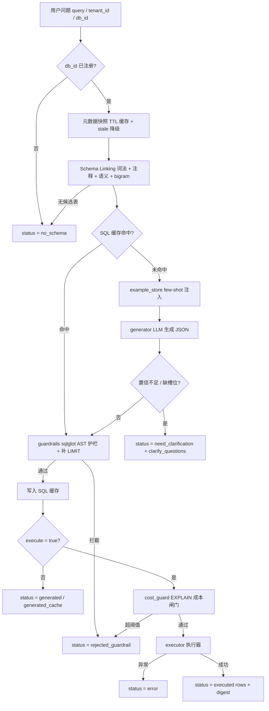

# nl2sql_skill

基于 `common_core` 组件的 MySQL 自然语言转 SQL 能力层。它不包含 LangGraph 编排，也不做回答生成与话术包装；只负责把自然语言问题转换为经过 sqlglot AST 安全校验的只读 SQL，可选委托执行器运行并返回结果集。

本文件面向想复用 / 扩展 / 部署该组件的开发者。调用方（agent / MCP client）只看 [SKILL.md](SKILL.md) 的调用契约即可。

## 架构总览

处理流程：




## 能力

- 多数据源注册与 information_schema 元数据采集（TTL 快照缓存 + stale 降级 + single-flight 去抖）。
- Schema Linking：词法匹配 + 列注释 + 语义层描述 + 字符 bigram 兜底召回；外键一跳扩展支撑 JOIN 推理。
- LLM 生成结构化 JSON（sql / confidence / used_tables / assumptions / clarify_questions）。
- sqlglot AST 安全护栏：SELECT/WITH 白名单、写操作/DDL/权限/文件导出拦截、强制 LIMIT、单语句校验。
- SQL 缓存：query + db_id + semantic_version + schema_fingerprint + model_tag 联合 key，命中后仍重跑护栏。
- 确定性槽位校验（时间敏感表缺时间范围时触发澄清）；多轮上下文预算截断。
- 可选执行编排：委托外部执行器，返回结果集 + 数值摘要 digest（行数 + sum/min/max/avg）。
- EXPLAIN 成本闸门：execute=true 前评估预估扫描行数，超阈值拒绝执行；失败按 deny/allow 策略降级。
- few-shot 示例库（JSONL 读侧）：db/tenant 隔离 + 相似度排序取 top_k。
- MySQL 5.x 语法子集提示：5.x 数据源禁止窗口函数/CTE，prompt 注入派生表替代约束。

## 文件布局

| 文件 | 职责 |
| --- | --- |
| `src/nl2sql_skill/builder.py` | 从环境变量/显式入参装配完整 pipeline |
| `src/nl2sql_skill/pipeline.py` | `NL2SQLPipeline` 总编排：元数据 → 召回 → 生成 → 护栏 → 执行 |
| `src/nl2sql_skill/metadata.py` | information_schema 采集 + SchemaSnapshot fingerprint + TTL 缓存 + stale 降级 |
| `src/nl2sql_skill/linking.py` | Schema Linker（词法打分、bigram 兜底、token 预算裁剪） |
| `src/nl2sql_skill/semantic.py` | 语义层加载（同义词、描述、时间过滤声明），JSON/YAML 双格式 |
| `src/nl2sql_skill/generator.py` | prompt 组装 + LLM 调用 + JSON 解析修复重试 + 5.x 语法子集提示 |
| `src/nl2sql_skill/guardrails.py` | sqlglot AST 校验器（写操作/越权/文件导出等拦截） |
| `src/nl2sql_skill/cost_guard.py` | EXPLAIN 成本闸门（FR-5.3） |
| `src/nl2sql_skill/example_store.py` | few-shot 示例库读侧（FR-7） |
| `src/nl2sql_skill/config.py` | 数据源注册表与行为开关的环境变量装载 |
| `src/nl2sql_skill/types.py` | NL2SQLRequest / NL2SQLResult dataclass 与状态码 |
| `src/nl2sql_skill/mcp.py` / `mcp_server.py` | MCP 服务入口与工具定义（`nl2sql_generate` / `/health`） |
| `tests/` | 106 个单元测试（护栏负样本、成本闸门、示例库、5.x 语法、digest、元数据降级） |

## 快速开始

### 安装

仓库内联编（monorepo，`common_core` 与 `nl2sql_skill` 同级目录）：

```bash
pip install -e ./common_core --no-deps
pip install -e "./nl2sql_skill[sql,semantic,mcp,test]"
```

单独安装 `nl2sql_skill`（`pyproject.toml` 已声明 common-core 的 git 依赖）：

```bash
cd nl2sql_skill
pip install -e ".[sql,semantic,mcp,test]"
```

依赖说明：`common-core[llm,cache]` 与 `sqlglot` 为必需；`pymysql`（`sql` extra）用于 MySQL 元数据采集与 EXPLAIN。

### 配置

复制 `.env.example` 为 `.env` 并按环境填写：LLM 地址/密钥/模型、`NL2SQL_DB_<ID>_DSN` 只读连接串。完整变量说明见 [.env.example](.env.example)。

### 最小示例

```python
import asyncio
from nl2sql_skill.builder import build_nl2sql_pipeline
from nl2sql_skill.types import NL2SQLRequest

pipeline = build_nl2sql_pipeline()  # 读 .env / 环境变量装配

async def main():
    result = await pipeline.generate(
        NL2SQLRequest(
            query="上个月华东区销售额 TOP10 的门店",
            tenant_id="t1",
            db_id="erp",
            request_id="req-1",
        )
    )
    print(result.status, result.sql)

asyncio.run(main())
```

带多轮上下文和执行：

```python
result = await pipeline.generate(
    NL2SQLRequest(
        query="只看杭州的",
        tenant_id="t1",
        db_id="erp",
        request_id="req-2",
        history=[
            {"question": "上个月各区域销量", "sql": "SELECT region, SUM(qty) FROM ..."},
        ],
        execute=True,
    )
)
print(result.status, result.rows, result.columns, result.digest)
```

## 部署为 MCP 服务

```bash
pip install -e ".[mcp]"
nl2sql-skill-mcp --env-file .env                                   # 默认 stdio，本地 MCP client 拉起
nl2sql-skill-mcp --env-file .env --transport streamable-http --port 8000  # HTTP 部署
```

- 鉴权沿用仓库统一约定（`common_core.mcp_auth`）：`AUTH_MODE=jwt` 时校验 JWT 的 `tenant_id` / `kb_id`（承载 `db_id`）claims 与请求一致；`disabled` 模式仍强制要求作用域参数齐全。
- `/health` 暴露脱敏配置状态与指纹；`METRICS_ENABLED=true` 时在 `METRICS_PORT`（默认 9090）暴露 Prometheus 指标。
- 可传入上游 W3C `traceparent` 串联分布式链路，响应携带 `trace_id`；未接追踪后端时由 pipeline 自动生成。

## 配置项

复制 `.env.example` 为 `.env` 后按环境填写。关键变量速查：

| 变量 | 默认 | 说明 |
| --- | --- | --- |
| `NL2SQL_LLM_BASE_URL` | — | OpenAI 兼容接口地址 |
| `NL2SQL_LLM_API_KEY` | — | 接口密钥 |
| `NL2SQL_LLM_MODEL` | — | 模型名 |
| `NL2SQL_DB_<ID>_DSN` | — | MySQL 只读账号连接串 |
| `NL2SQL_DB_<ID>_SERVER_VERSION` | 8.0 | 5.x 时注入受限语法子集提示 |
| `NL2SQL_DB_<ID>_VISIBLE_TABLES` | 空=全部 | 表白名单 |
| `NL2SQL_EXAMPLE_STORE_PATH` | 空=不启用 | few-shot 示例库 JSONL 路径 |
| `NL2SQL_EXAMPLE_MIN_SIMILARITY` | 0.75 | 示例注入相似度下限 |
| `NL2SQL_COST_GUARD_ENABLED` | false | EXPLAIN 成本闸门开关 |
| `NL2SQL_COST_THRESHOLD_ROWS` | 5000000 | 预估扫描行数上限 |
| `NL2SQL_EXPLAIN_FAIL_POLICY` | deny | EXPLAIN 失败策略 deny/allow |
| `NL2SQL_SEMANTIC_DIR` | 空=不启用 | 语义层 YAML/JSON 目录 |
| `NL2SQL_CLARIFY_THRESHOLD` | 0.75 | 置信阈值 |
| `NL2SQL_MAX_ROWS` | 200 | 行数上限 |
| `NL2SQL_SQL_CACHE_ENABLED` | true | SQL 缓存开关 |
| `NL2SQL_SQL_CACHE_TTL_SECONDS` | 86400 | 缓存 TTL |

完整说明见 [.env.example](.env.example) 内注释。

## 测试

在包目录下运行：

```bash
cd nl2sql_skill
python -m pytest tests -q
```

覆盖：护栏负样本（写操作、命令注入、文件访问、越权访问、混淆绕过，共 32 条拦截 + 9 条正向回归）、成本闸门、few-shot 示例库、MySQL 5.x 语法提示、结果集 digest、元数据 stale 降级与并发去抖、MCP 契约。

## 边界与 Roadmap

- 不包含 LangGraph：编排由上层 agent 或 instances 完成。
- 不做回答文本生成与话术润色：调用方拿到 rows/sql 后自行组装回复。
- 非 MySQL 方言暂不支持（PostgreSQL / ClickHouse 列入后续 Roadmap）。
- 权限系统由外部实现；本工具消费 visible_tables 做表级过滤，列级权限待后续版本补充。