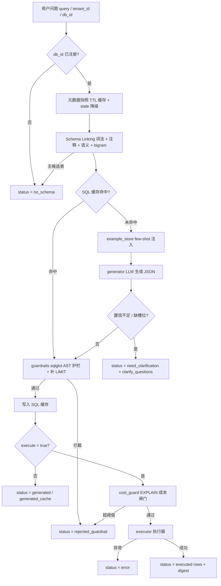

# nl2sql_skill

基于 `common_core` 的 MySQL 自然语言转 SQL 能力层。它不包含 LangGraph 编排，也不做回答生成；只负责把自然语言问题转换为经过 sqlglot AST 安全校验的只读 SQL，并可选执行返回结果集。

调用方（agent / MCP client）只看 [SKILL.md](SKILL.md) 的调用契约；部署与二次开发操作见下文。

## 核心能力

- 多数据源注册与 information_schema 元数据采集（TTL 快照缓存、stale 降级、single-flight 去抖）
- Schema Linking：词法 + 列注释 + 语义层 + bigram 召回，外键一跳扩展支撑 JOIN 推理
- LLM 生成结构化 JSON：sql / confidence / used_tables / assumptions / clarify_questions
- sqlglot AST 安全护栏：只读白名单、写操作/DDL/文件导出拦截、强制 LIMIT、单语句校验
- SQL 缓存：query + db_id + semantic_version + schema_fingerprint + model_tag 联合 key
- 可选执行编排：委托外部执行器返回结果集与数值摘要 digest
- EXPLAIN 成本闸门、few-shot 示例库、MySQL 5.x 语法提示

## 处理流程



## Docker 快速开始（推荐）

镜像已发布到 GHCR，无需本地安装 Python 依赖：

```bash
docker pull ghcr.io/pnj-star/nl2sql_pipeline:v0.1.4
```


启动并验证：

```bash
docker run -d --name nl2sql -p 8000:8000 --env-file .env ghcr.io/pnj-star/nl2sql_pipeline:v0.1.4
curl http://127.0.0.1:8000/health
docker logs nl2sql
docker stop nl2sql
```


## 本地开发
```
python -m venv .venv
pip install -e ".[sql,semantic,mcp,test]"
Copy-Item .env.example .env   
```

最小调用示例：
```python
import asyncio
from nl2sql_skill.builder import build_nl2sql_pipeline
from nl2sql_skill.types import NL2SQLRequest

async def main():
    result = await build_nl2sql_pipeline().generate(
        NL2SQLRequest(
            query="介绍一下羊肚菌的优点，以及它的押金是多少",
            tenant_id="",
            db_id="",
            request_id="",
        )
    )
    print(result.status, result.sql)

asyncio.run(main())
```

本地起 MCP 服务：

```bash
nl2sql-skill-mcp --env-file .env --transport streamable-http --port 8000
```

如果提示找不到 `nl2sql-skill-mcp`，确认已激活虚拟环境，或改用等价命令：
```bash
python -m nl2sql_skill.mcp --env-file .env --transport streamable-http --port 8000
```

## 测试
```bash
python -m pytest tests -q
```

## 边界与 Roadmap
- 不包含 LangGraph 编排，也不做回答文本生成
- 当前优先支持 MySQL 5.7 / 8.0，PostgreSQL / ClickHouse 后续规划
- 列级权限依赖外部系统，当前通过 `visible_tables` 做表级过滤